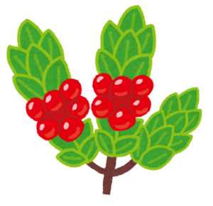

# Shrub Router



Shrub is a minimal clientside router that gracefully degrades without Javascript. Shrub is only 3KB gzipped and allows
you to:

* implement clientside navigation with almost no configuration,
* fall back to full server side routing so that everything still works without Javascript,
* keep all your HTML on the server side and avoid bundling your HTML into your `.js` files, and
* avoid using a large framework like vue-router.

Normally, when you click links on a page, your browser navigates to the linked page, which reloads the entire page. You
might not the entire page to reload — for example, maybe you want a music player to keep playing. A clientside router
allows your users to navigate between pages without having to reload the entire page. Instead of having the browser
navigate to a different page, the clientside router loads that page on its own, in this case with a `fetch()` request to
the server for the new HTML, and replaces the old HTML with the new HTML.

## Implementation Details

Shrub intercepts all click events and tries to determine whether that click would result in navigation. In simple terms,
this means adding some special behaviour when `<a>` elements are clicked, when a `<button>` is clicked inside a
`<form>`, and so on.

When such a navigating click is intercepted, Shrub will figure out which URL the action would navigate to, for example
the `href` on an `<a>`, or the `action` on a `<form>`. Shrub will then make a request to that page using `fetch()`.

When using a clientside router, it's usually desirable to be able to only navigate the main content of the page, not to
replace the HTML of the entire page. Shrub does this by identifying the body of the old page and the body of the new
page, and replacing the former with the latter. Shrub does this by looking for a `<main>` element — remember that there
can only be one `<main>` tag per page. Therefore, everything in the old `<main>` will be replaced with the new `<main>`
from the fetched page. This means that you don't need to serve the body of the page at some specific template URL —
Shrub will simply make a request for the new page at the usual URL the user would normally navigate to.

## Usage

First, `npm install shrub-router`. You can then import and initialise it:

```
import ShrubRouter from 'shrub-router'
ShrubRouter.init();
```

You need to tell Shrub about which routes you want to be handled. Any routes that you don't tell Shrub about will not be
intercepted. When the user clicks on these non-intercepted routes, the browser will navigate normally, reloading the
page.

To add routes that replace the page body with the fetched page, use `ShrubRouter.add()`:

```
ShrubRouter.add('/');
ShrubRouter.add('/about');
ShrubRouter.add('/about/details');
```

If you want to perform a custom action when a route is navigated to, specify a handler to replace the default one:

```
ShrubRouter.add('/contact', () => {
	document.write("Hello world");
});
```

You can remove a route with `ShrubRouter.remove('/contact')`.

There is one important thing to note related to the initialisation of Javascript included in the page. Normally, you
would want to run your Javascript code when the page has loaded, by adding a listener for `DOMContentLoaded` or by
placing your code at the bottom of your HTML. When using Shrub, you obviously want your code to be not only on the
initial page load, but also when a page is navigated to. Therefore, you should place all of your in-page Javascript code
within an event listener for `shrub:loaded`:

```
window.addEventListener('shrub:loaded', () => {
	PetiteVue.createApp({
		name: 'Timmy',
	}).mount();
});
```

## Useful Notes

When making requests for pages using `fetch()`, Shrub adds a `Shrub-Router: true` header, which you can use to add
custom behaviour for requests made by Shrub on the server side.

## Limitations

The interception of click events could be further improved:

* Clicks on `<input type="submit">` elements should be intercepted
* Clicks on `<button type="button">` elements should not be intercepted. A button with `type="button"` inside a form
	should not submit the form, hence should not navigate, and therefore should not be intercepted at all.

Some new features could be added for ease of use:

* Users that want Shrub to intercept navigation for _all_ pages should be allowed to specify this instead of manually
	calling `.add()`. This would give Shrub a truly zero-configuration option.

## Acknowledgements

Written by [Vlad-Stefan Harbuz](https://vladh.net).

MIT-licensed.

Originally based on [Pinecone Router](https://github.com/pinecone-router/router), which is MIT-licensed.
